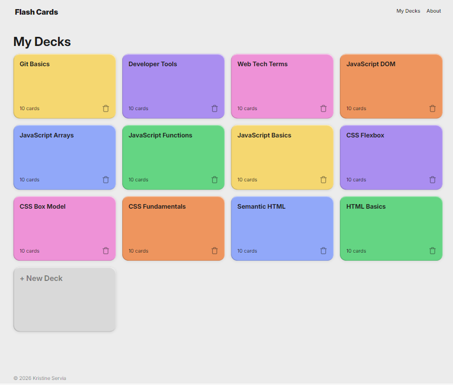
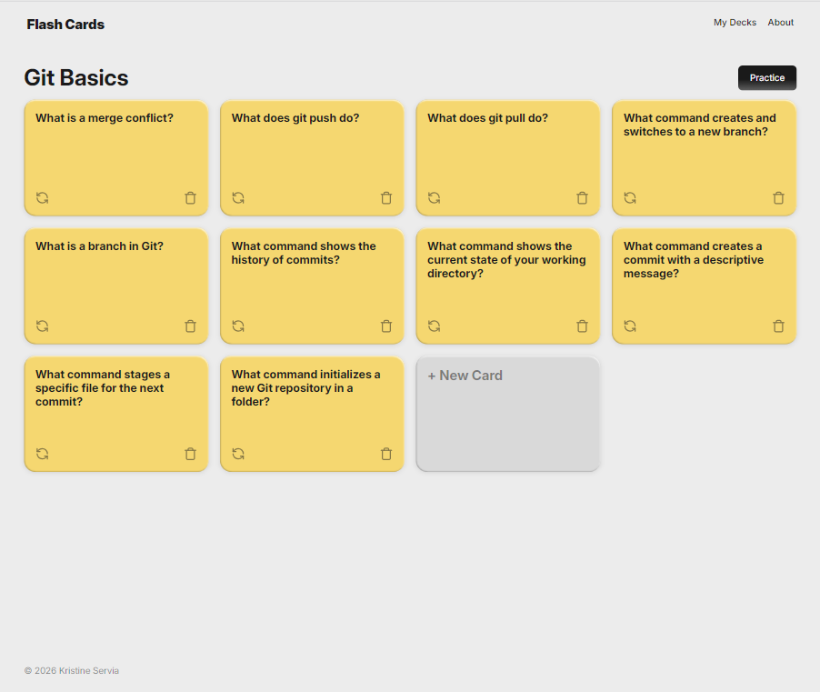
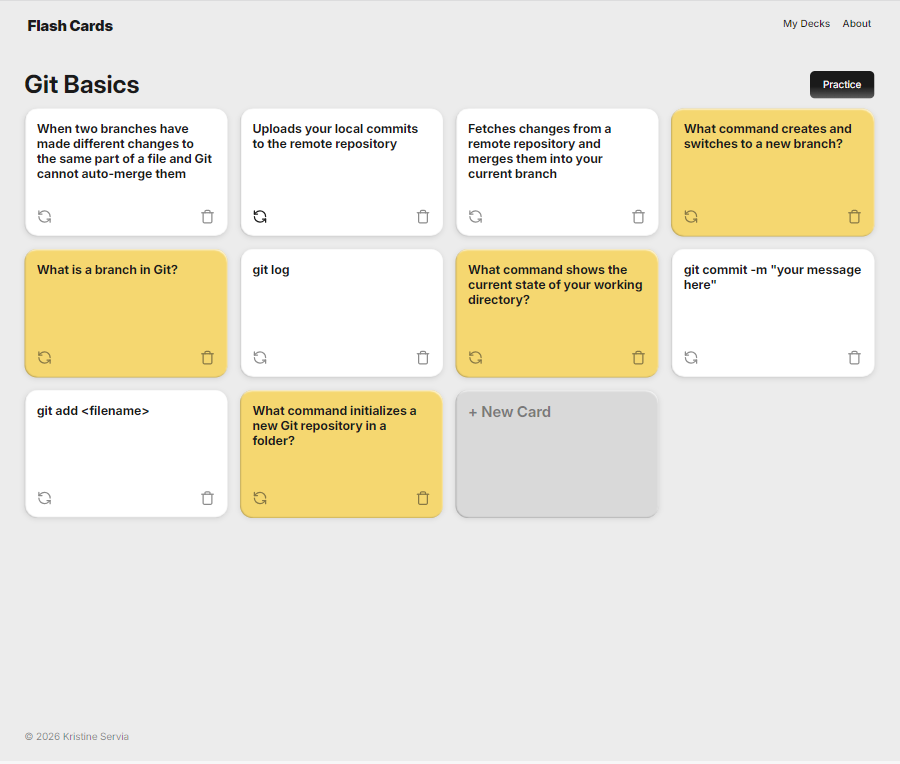
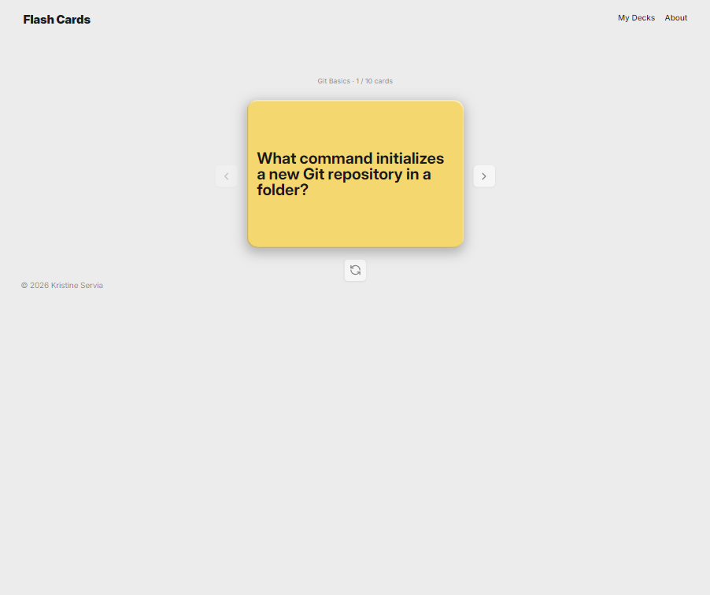
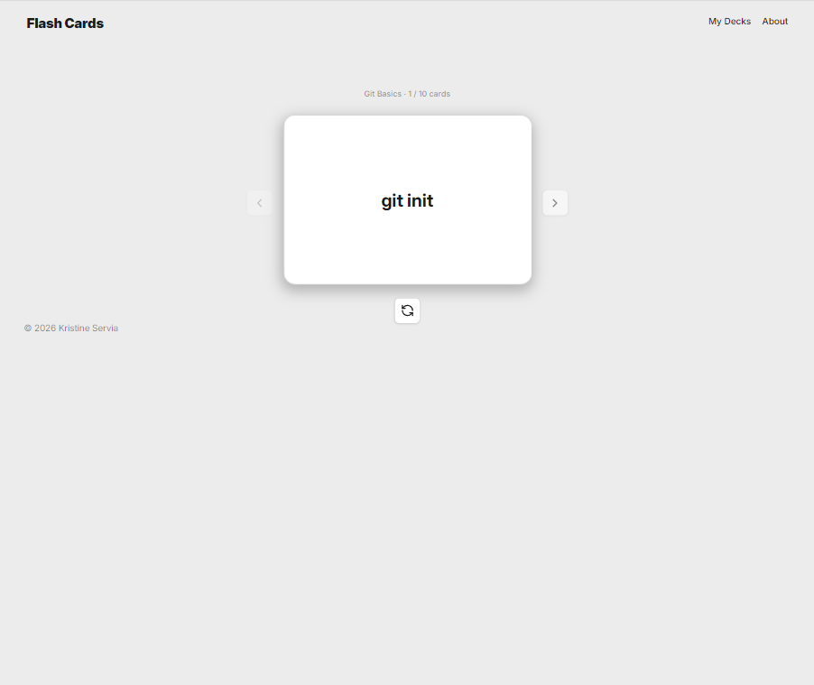
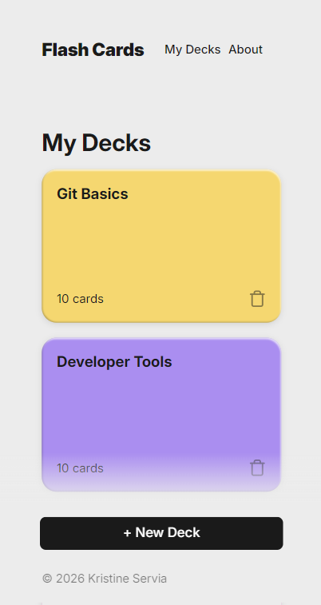
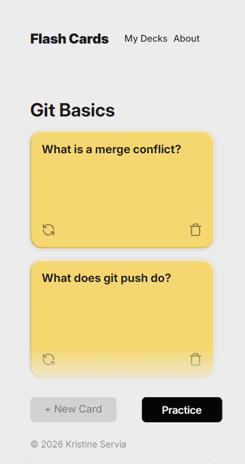
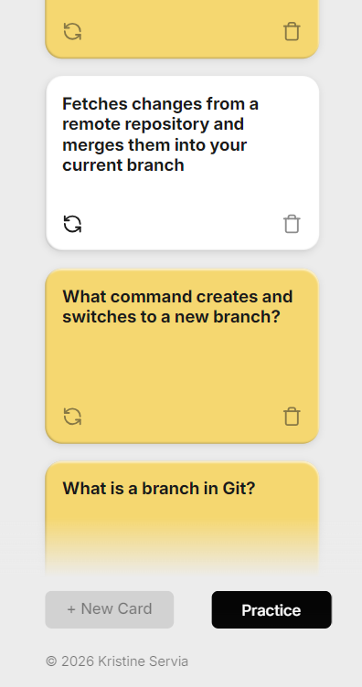
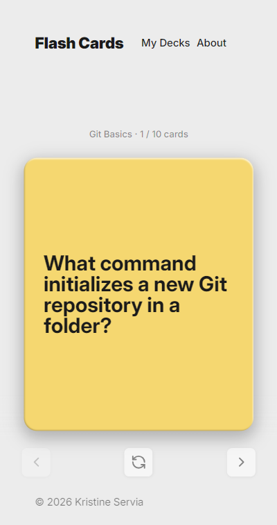
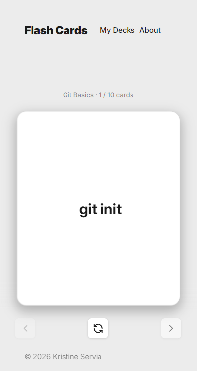

# Flashcard App

#### This is my first project in TripleTen's AI-Assisted Software Engineering program. The Flashcard App is a tool intended to be a study aid resource, where a user can browse a collection of flashcards depicting questions and answers regarding Web Development.

## Features

My Flashcard App features:

- A collection of clickable decks, displayed in a grid formation on the home page. Each deck contains a particular Web Development study topic.
- An open deck view when we click on a deck, where all the cards in a single deck display a question for the topic, and a flip button on the card displays the answer to the question. The delete button on the card removes the card from the deck collection. Note: Deleted cards reappear on refresh, as data is not yet persisted.
- A "Practice" button on the top right corner above the open deck of cards leads to the Carousel View of the specific deck selected.
- The Carousel navigation page, displayed for the selected deck, enables browsing through its group of cards by using the left and right arrow buttons. Clicking the flip button underneath each card on the Carousel reveals the answer to the question.
- Responsive design layout for mobile viewing of home view, open deck view, and carousel view, with "Practice" and navigation button functionality.
- Forthcoming: The Flashcard App will soon feature the opportunity to create customized decks of the user's choosing with a functional +New Deck button.

## Technologies Used

**HTML**

- HTML was used to build the structure of the Flashcard App.

**CSS**

- CSS was used to add styling to each component in the App.

**JavaScript**

- JavaScript was used to add interactivity to each deck in the App.

## Screenshots

## Deployed site

Check out [Flashcards](https://kristineservia.github.io/ai-se_project_flashcards/) on GitHub Pages.
