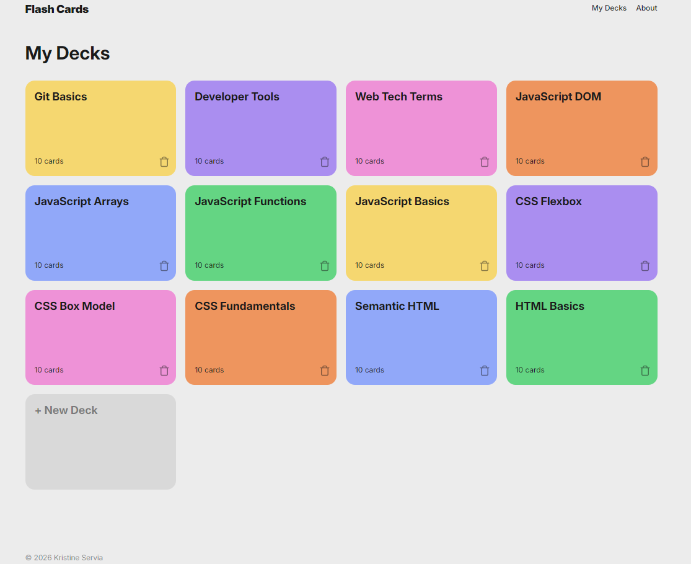
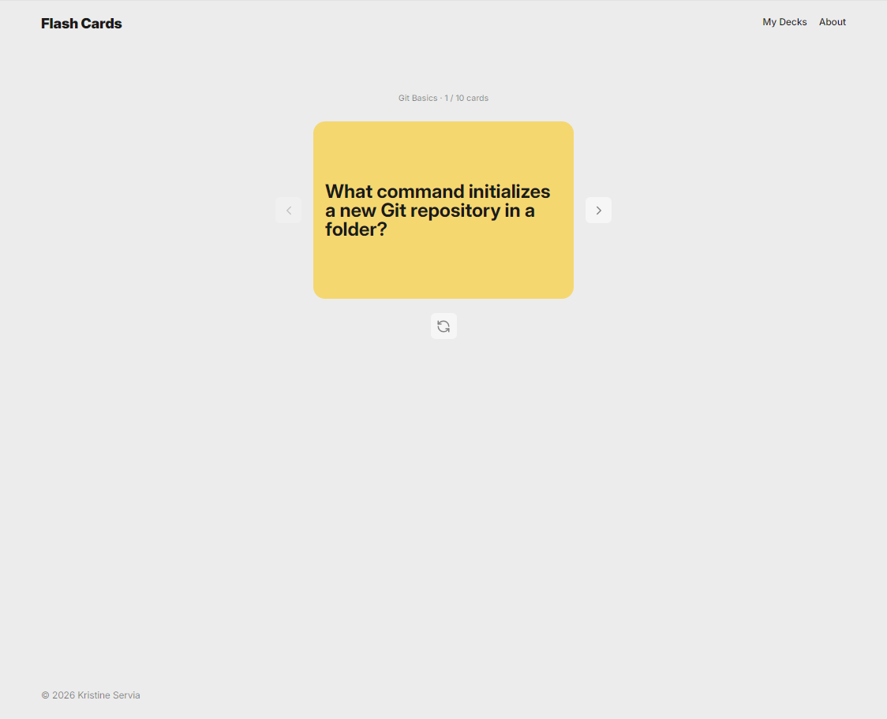
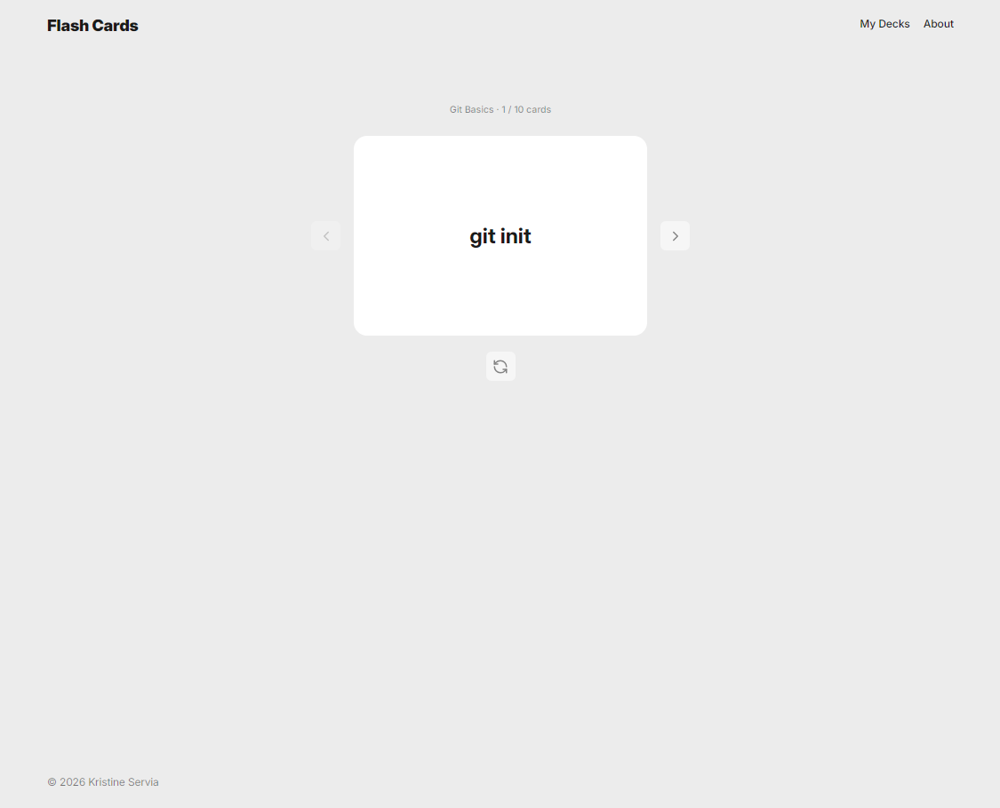
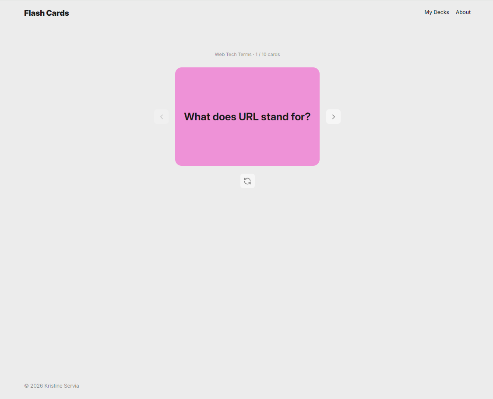
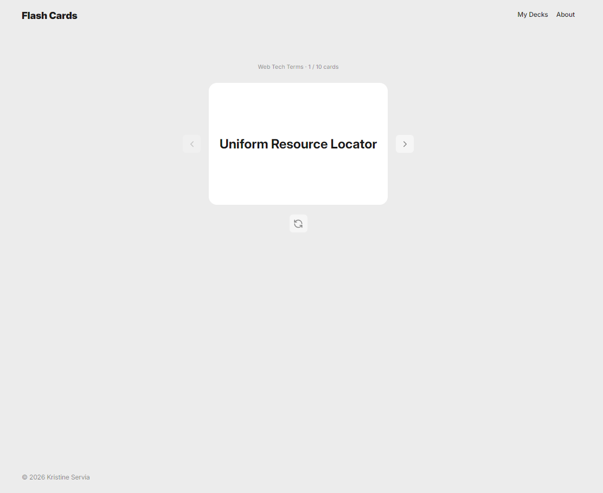
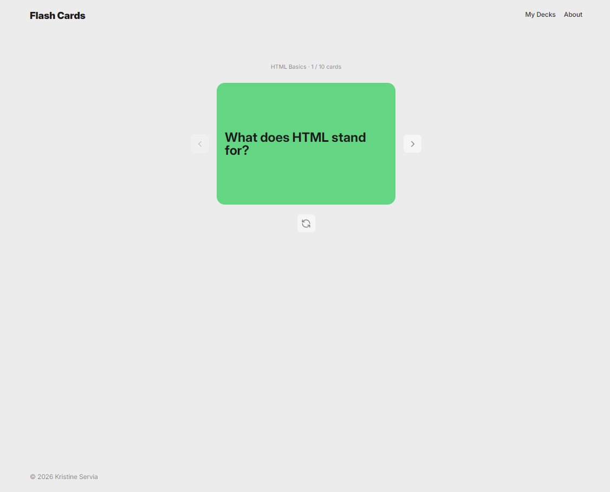
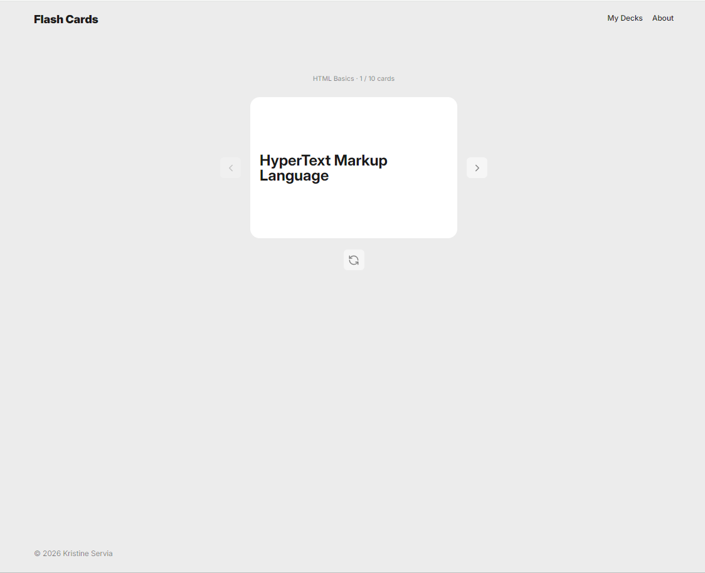
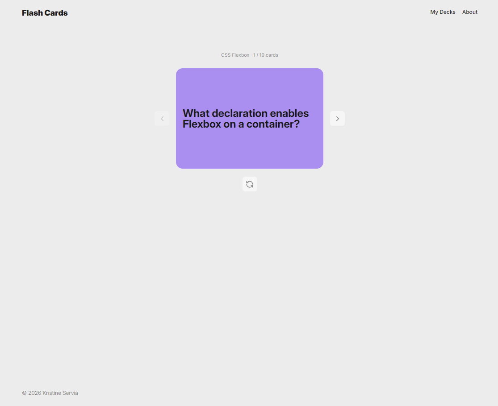
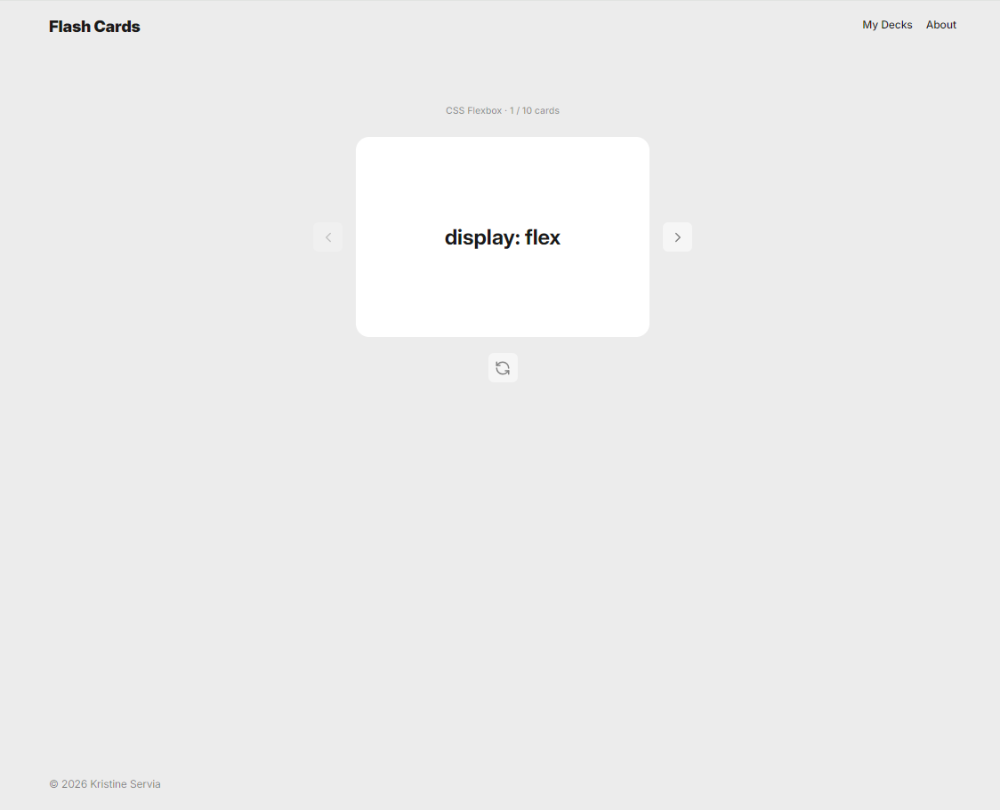

# Flashcard App

#### This is my first project in TripleTen's AI-Assisted Software Engineering program. The Flashcard App is a tool intended to be a study aid resource, where a user can browse a collection of flashcards depicting questions and answers regarding Web Development.

## Features

My Flashcard App features:

- A collection of 12 clickable decks, displayed in a grid formation on the home page. Each deck contains a particular Web Development study topic.
- A Carousel navigation page, displayed for any selected deck, to browse through a group of 10 cards within each deck by using the left and right arrow buttons.
- Each card in a deck contains a question on the particular Web Development study topic, and by clicking on the flip button underneath each card, you can see the answer to the question.
- Forthcoming: The Flashcard App will soon feature the opportunity to create customized decks of the user's choosing with a functional +New Deck button.

## Technologies Used

**HTML**

- HTML was used to build the structure of the Flashcard App.

**CSS**

- CSS was used to add styling to each component in the App.

**JavaScript**

- JavaScript was used to add interactivity to each deck in the App.

## Screenshots

## Deployed site

Check out [Flashcards](https://kristineservia.github.io/ai-se_project_flashcards/) on GitHub Pages.
