# Flashcard App

#### This is my first project in TripleTen's AI-Assisted Software Engineering program. The Flashcard App is a tool intended to be a study aid resource, where a user can browse a collection of flashcards depicting questions and answers regarding Web Development.

## Features

My Flashcard App features:

- A collection of clickable decks, displayed in a grid formation on the home page. Each deck contains a particular Web Development study topic.
- An open deck view when we click on a deck, where all the cards in a single deck display a question for the topic, and a flip button on the card displays the answer to the question. The delete button on the card removes the card from the deck collection. Note: Deleted cards reappear on refresh, as data is not yet persisted.
- A "Practice" button on the top right corner above the open deck of cards leads to the Carousel View of the specific deck selected.
- The Carousel navigation page, displayed for the selected deck, enables browsing through its group of cards by using the left and right arrow buttons. Clicking the flip button underneath each card on the Carousel reveals the answer to the question.
- Responsive design layout for mobile viewing of home view, open deck view, and carousel view, with "Practice" and navigation button functionality.
- NEW! The Flashcard App features the opportunity to create customized decks of the user's selected study topic with the functional + New Deck button. The button takes the user to the New Deck form, where they can select the deck's color and enter the study topic of their choice in the provided format. The new deck's data is sent to a remote API, and once the deck is successfully created, it is added to the app and displayed on the homepage.
- NEW! The New Deck form includes validation and error handling. If the data entered in the New Deck form is invalid, an error message alerts the user by displaying an error modal, before any deck data is sent to the remote API. Once the data is valid, a new deck object is created and sent to the API.

## Technologies Used

**HTML**

- HTML was used to build the structure of the Flashcard App.

**CSS**

- CSS was used to add styling to each component in the App.

**JavaScript**

- JavaScript was used to add interactivity to each deck in the App.

## Screenshots

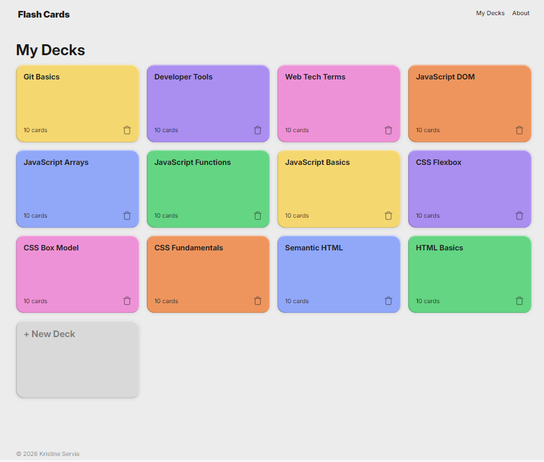

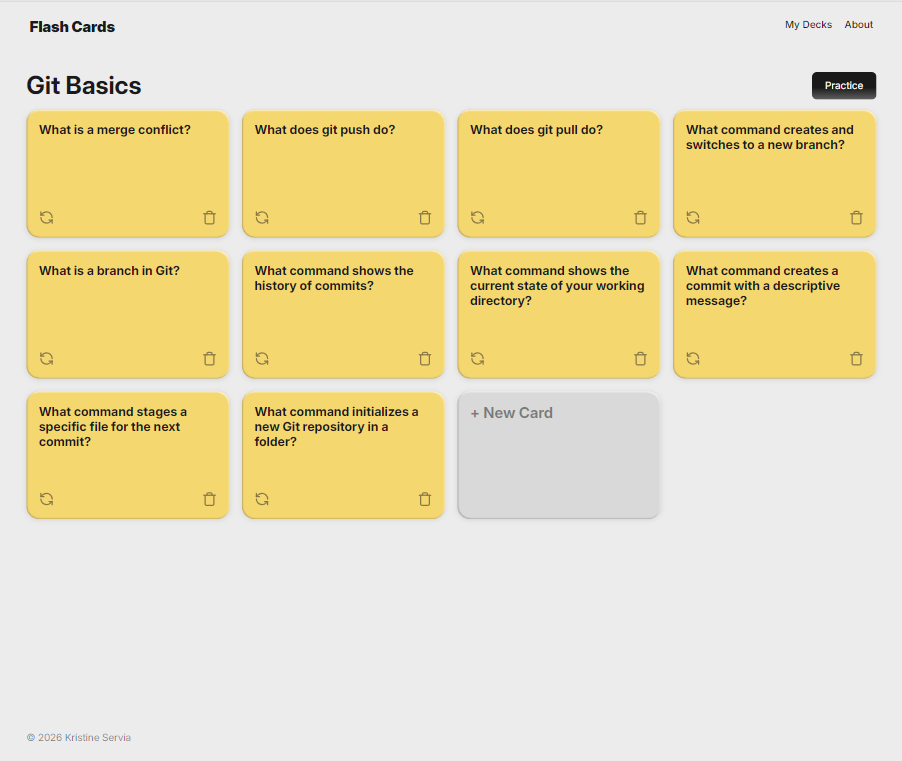

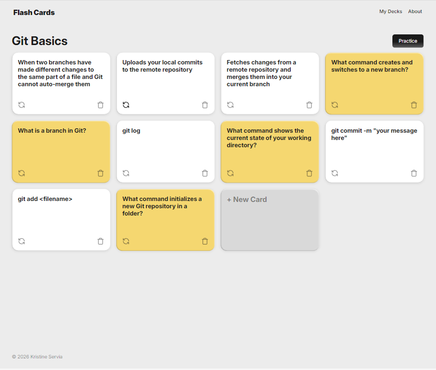

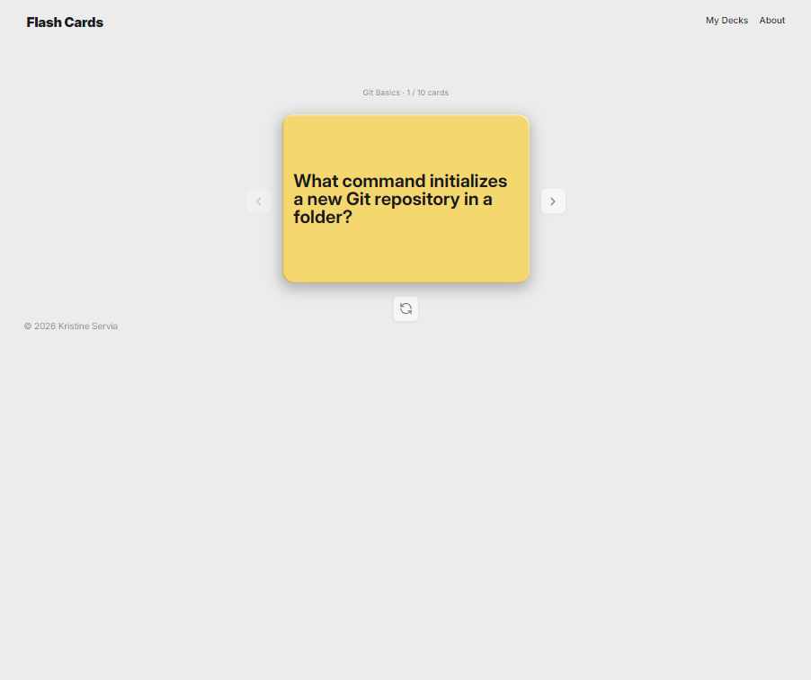

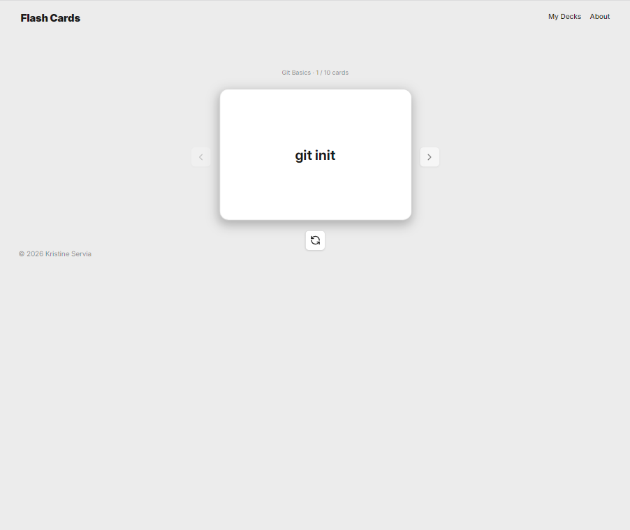

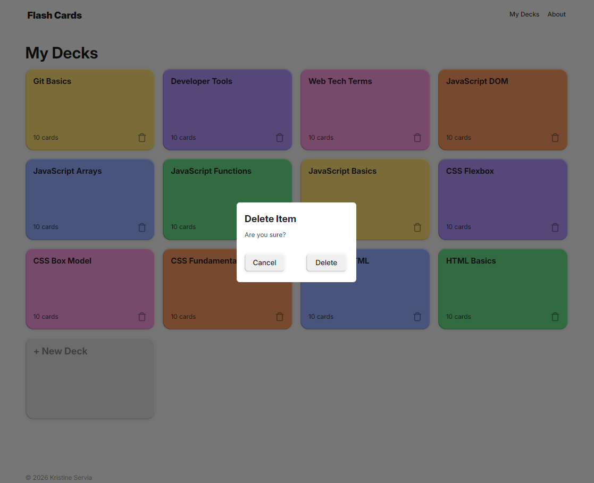

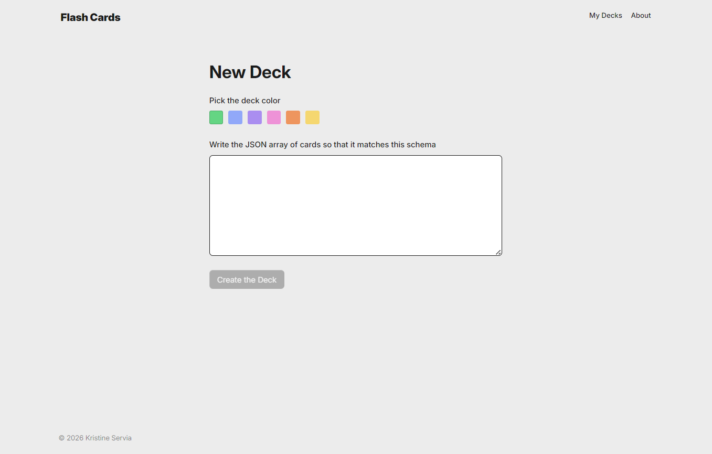

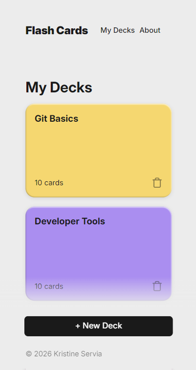

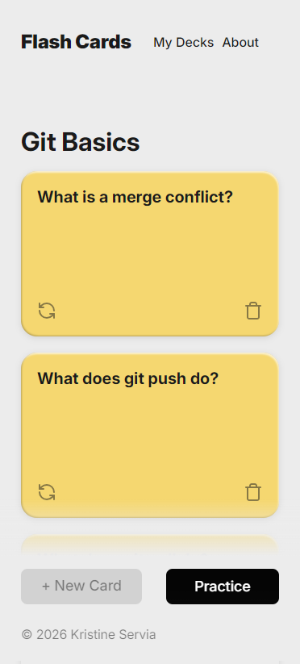

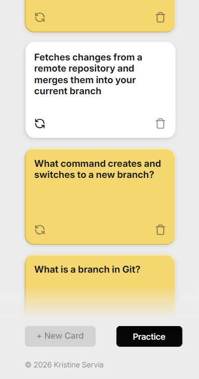

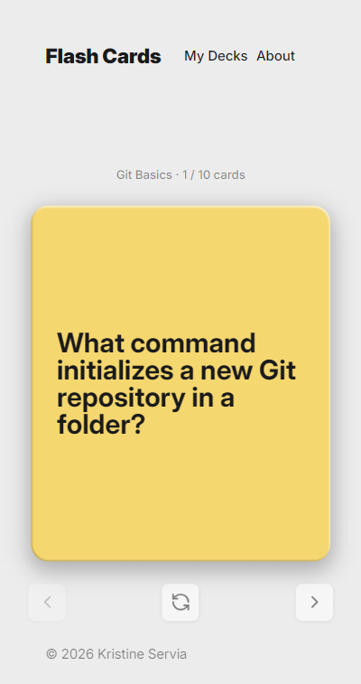

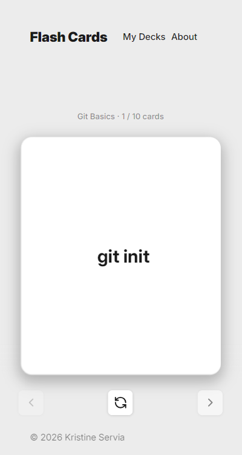

## Project Pitch Video

Check out the [Project Pitch](https://drive.google.com/file/d/1qZKZBR5ozKY_FJEb1rW19yw3hZJLAMun/view?usp=sharing) short video, where I decribe my project, and a challenge I faced while buidling it.

## Deployed site

Check out [Flashcards](https://kristineservia.github.io/ai-se_project_flashcards/) on GitHub Pages.
